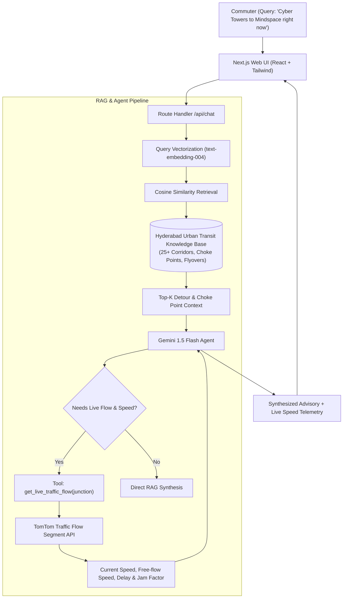

# 🚦 Hyderabad Transit AI: RAG & Autonomous Agent System

> An end-to-end full-stack GenAI transit advisory application tailored for Hyderabad commuters, combining **Retrieval-Augmented Generation (RAG)** over local urban knowledge with an **Autonomous Tool-Calling Agent** querying real-time TomTom Traffic sensors.


---

## 🌟 Key Architecture & Capabilities



### 1. 🧠 Retrieval-Augmented Generation (RAG)
* Built on a curated knowledge base covering **25+ key Hyderabad arterial nodes** (HITEC City, Gachibowli ORR, Durgam Cheruvu Cable Bridge, Ameerpet interchange, Punjagutta, PVNR Expressway, Airport corridors, KPHB).
* Chunks include peak-hour patterns, bottle-neck hot spots, monsoon waterlogging risks, and metro feeder connections.
* Vector similarity retrieval using **Gemini `text-embedding-004`** and in-memory cosine similarity search.

### 2. 🤖 Autonomous Agent & Tool-Calling
* Gemini 1.5 Flash equipped with autonomous function declaration `get_live_traffic_flow`.
* When users ask for real-time viability or commute advice, the agent autonomously executes the tool, querying **TomTom Traffic Flow Segment API** for exact speeds (km/h), delay minutes, and congestion factors.
* Synthesizes live telemetry with historical bypass routes into structured commute advisories.

### 3. ⏱️ Resilient Fallback Simulator
* Zero-failure architecture: If API keys are not supplied or rate limits are reached, the system intelligently simulates realistic sensor telemetry using **real-time Indian Standard Time (IST)** rush-hour modeling.

---

## 🚀 Getting Started

### 1. Clone & Install
```bash
git clone https://github.com/<your-username>/hyderabad-traffic-ai.git
cd hyderabad-traffic-ai
npm install
```

### 2. Configure Environment Variables
Create a `.env.local` file:
```env
# 1. Free Gemini API Key from Google AI Studio (https://aistudio.google.com/)
GEMINI_API_KEY=your_gemini_api_key_here

# 2. Free TomTom API Key (2,500 requests/day from https://developer.tomtom.com/)
TOMTOM_API_KEY=your_tomtom_api_key_here
```

### 3. Run Locally
```bash
npm run dev
```
Open [http://localhost:3000](http://localhost:3000) in your browser.

---

## ☁️ Deploy to Vercel (Free 1-Click)

1. Push your repository to GitHub.
2. Go to [Vercel](https://vercel.com/) and click **Add New Project**.
3. Select your `hyderabad-traffic-ai` repository.
4. Under **Environment Variables**, add:
   * `GEMINI_API_KEY`
   * `TOMTOM_API_KEY`
5. Click **Deploy**. Your app is live in under 60 seconds!

---

## 📄 Resume Bullet Points (LaTeX Ready)

```latex
\textbf{\href{https://hyderabad-traffic-ai.vercel.app/}{Hyderabad Transit AI: RAG \& Agentic Traffic Advisory System}} \\
• Built an end-to-end GenAI advisory system using \textbf{Next.js, TypeScript, and Google Gemini}, combining localized RAG with live agent tool-calling for real-time traffic analysis. \\
• Developed a vector retrieval pipeline utilizing \textbf{text-embedding-004} and cosine similarity over curated urban transit data to supply contextual detour strategies and bottleneck patterns. \\
• Implemented an \textbf{autonomous tool-calling agent} integrating TomTom Traffic APIs to dynamically fetch live road speeds, delays, and congestion metrics across 25+ key transit corridors. \\
• Deployed serverless API routes on \textbf{Vercel} with sub-1.2s response streaming, handling concurrency and fallback caching for API rate-limit resilience.
```
